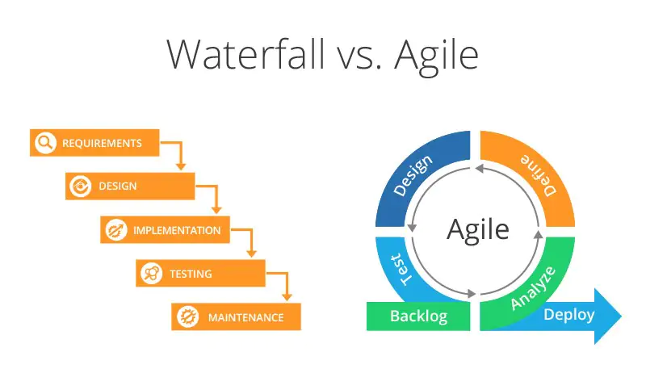
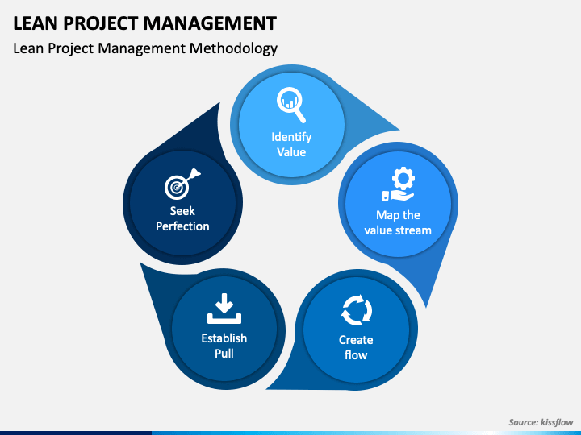

# Agile & lean project management

Agile project management is one of many ways to manage a project. It is an iterative method, meaning that the team can fit in changes and give feedback throughout the process. Agile method first got its start in 2000 with 17 software developers. While it was introduced in 2000s agile method gained popularity in 2010s

# Phases

<figure>
    
    <figcaption>
         Waterfall vs. agile method 
        <i>Source: https://www.nimblework.com/wp-content/uploads/2022/12/waterfall-vs-agile-2.webp</i>
    </figcaption>
</figure>

 
 

Unlike waterfall model in agile the team can change things between phases. The project is divided into smaller parts called sprints. Sprints are shorter in time and the goal is smaller in scope. Between these sprints the team reviews what they have accomplished and set new goals for upcoming sprints. These sprints allow the team to get feedback from the customer in a smaller timeframe and implement the required changes to the final product. In turn this also means that the customer itself is also more involved in the process. Having smaller goals means that the team can see the progress quicker than in other methods.

## Hybrid method

Hybrid method is a mix between both agile and waterfall methods. Waterfall is used to plan the high-level phases while agile is used for tasks. Waterfall allows the project to have a clear deadline and milestones. Using Agile in hybrid method allows the team to break the project into smaller more manageable parts.

## Lean method

<figure>
    
    <figcaption>
         Lean method 
        <i>Source: https://cdn.sketchbubble.com/pub/media/catalog/product/optimized1/7/4/74ee6d1b6222545b259c3ffd3aa5dfdedc45af8955a8218ebb9121eaf2a1ffab/lean-project-management-slide1.png </i>
    </figcaption>
</figure>

 
 

In lean methods 5 phases identifying value comes from the customer itself. Customer is the one that defines the value of the product. Mapping the value stream is seeing what is necessary in the process and optimizing it. Making that stream flow without any problems or interruptions is also a core part of the method. While using the lean method it's also essential to not do anything that is not asked or planned for.

### References and additional reading

[History of the agile methodology](https://www.infoworld.com/article/3655646/a-brief-history-of-the-agile-methodology.html)

[Agile project management](https://www.techtarget.com/searchcio/definition/Agile-project-management)

[Beginner's guide to agile project management](https://business.adobe.com/blog/basics/agile)

[Lean project management](https://www.pmi.org/learning/library/lean-project-management-7364#)

[Agile design process](https://uxdesign.cc/agile-design-process-24be92018ad2)

[Fundamentals of the lean methodology](https://blog.kainexus.com/the-fundamentals-of-the-lean-methodology)
