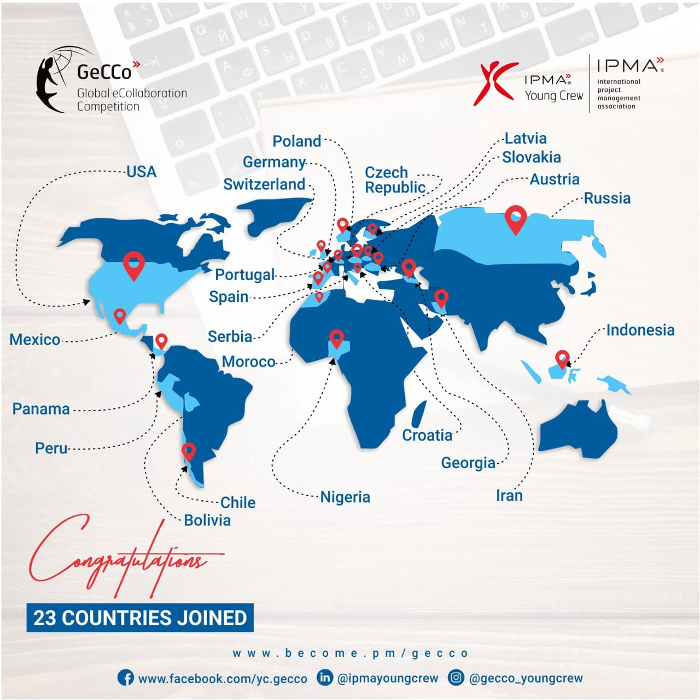

# Project management competitions 

 

Project Management Competition is developed and planned in Finland by Projektiammattilaiset ry:n Young Crew. Competition has grown into international level. International Project Management Association (IPMA) has arranged yearly Project Management championship competitions, where under 35-year-olds university students that are interested in project management and developing it can participate. The competitions first phases are organized by IPMA’s national sub-organizations where six teams get chosen to the national finals. For example, in year 2020 Finnish national competitions got the task to plan an office’s relocation project. The winner of the national comptetion gets to participate in the international finals to compete against other countries. In the year 2021 Finnish Haaga-Helia's team won the project management competitions championship. 

IPMA also organizes International Global eCollaboration Competition (Gecco) where the project team members get chosen randomly from different countries. Gecco –competition is kept entirely online, and it lasts 24 hours. The teams get one topic that they will work with and within the given 24 hours the project must be done.  

PMI Global doesn’t organize international competitions themselves but PMI Global’s sub-organizations arrange their own competitions. For example, Hong Kong’s case competition final was in January 2021. 36 teams participated in the competition. 

<figure>
    
    <figcaption>
         International Global eCollaboration Competition (Gecco) 2020/2021 
        <i>Source: https://ipma.world/news/gecco-2020-21-journey-has-started-join-us/ </i>
    </figcaption>
</figure>

 

## What is the purpose of the competitions and for whom they are aimed at 

The purpose of competitions is to create a way to compare peers against each other. This is a good way to create some tension and pressure in order to get results. The competition creates a real working experience that would prepare students towards real life working experience. Competitions can also be seen as networking events. 

The competitions are aimed towards students before age 35 and studying something related project management.  

Important things in competitions and project management in general is, how to motivate other people and make them achieve the wanted results. Key points also consist good ways to manage projects, worklists and how to process audits.  

The organizations preparing these competitions believe that leaders need to understand the purpose of project management within organizations and starting with why. After why comes how to achieve the wanted project and lastly what are needed in order to complete it. 

 

## How project management competitions increase the substance knowledge in project work and project management and their impact on the field.  

Substance knowledge is increased by simulating the real work environment in the competitions. Competitions are a way to find good project managers and teams. By joining, participants network and can form connections to a lot of people for the future endeavours ahead. Taking part in these competitions will also give the competitors a possibility to learn tips and tricks directly from their peers. 

Competing in such an event may be the first time for a student to do some sort of project management. This is important because usually in a workplace it can take years to achieve a project management role. 

 

## Advantages and impact of competitions in project management 

Project management is a combination of different skills and knowledge about the project itself and this means that project management can be studied and mastered like any other skill. Some drawbacks of learning project management while working on a real project are the resources needed to run it and the stress of possibly losing time and money while still learning the basics. You can study the skills individually and know a lot of theory surrounding possible future projects but e.g., communication, scheduling, time management and risk management skills are a lot harder to learn just from books.  

In a project management competition set number of groups battle against each other by doing some tasks related to project management, managing a fully simulated project or some combination of both. The simulated projects are based on real life projects and include real problems that the groups as project managers must solve. No matter if the projects are in a simulated environment or if the task is to do tasks related to project management, it is quite easy to vary the speed, difficulty and project type based on the needs and the skill level of the participants. With these benefits it is possible to gain experience and get feedback with a quicker interval compared to real projects, while at the same time not having to stress about wasting time or money. (Hanel, 2019)  

In these competitions it is possible to network with a wide variety of people while at the same time learning valuable skills for the future. Winning a project management competition may also give an advantage while applying for a job and on top of that some competitions hand out money prizes. 

 

## The Influence of Project Management Competitions on the Profession 

Project management competitions are an increasingly popular way to encourage and recognize excellence in project management. By offering a challenging and stimulating environment where aspiring project managers can practice and hone their skills, these competitions can help develop the skills and knowledge needed to be successful in the profession. 

Project management competitions are an important forum for recognizing and rewarding outstanding project management performance. Competitions allow participants to demonstrate their expertise in a variety of project management topics, including risk management, change management, quality management, stakeholder management, and procurement. Through this platform, participants can showcase their skills, build relationships with other project management professionals, and gain recognition for their accomplishments. 

In addition to offering a means for recognizing excellence in project management, competitions also serve as a valuable learning environment. By participating in a competition, aspiring project managers can develop their knowledge and skills by solving challenging problems, working with teams to develop project plans, and engaging in critical thinking. Competitions also provide an opportunity to gain exposure to new technologies, project management methodologies, and best practices. 

 

### References and additional reading:

[Hanel, C. (2019) What is the "International Project Management Championship"](https://www.ipma.world/news/what-is-the-international-project-management-championship-short-ipmc/) (Accessed: January 23, 2023). 

[Suomen karsinnan voittaja IPMA:n kilpailussa](https://www.projektimaailma.fi/artikkelit/vuoden_2021_ipma_project_management_championship_suomen_voittaja_on_selvilla.1525.news )

[IPMA events and competitions](https://www.ipma.world/ipma-young-crew/competitions-and-events/) 

[Quality of project management and competition between companies](https://en.talaia-openppm.com/competitive-advantage-with-project-management/) 

[Quality of project management and competition between companies](https://www.emerald.com/insight/content/doi/10.1108/IJMPB-02-2020-0042/full/html) 