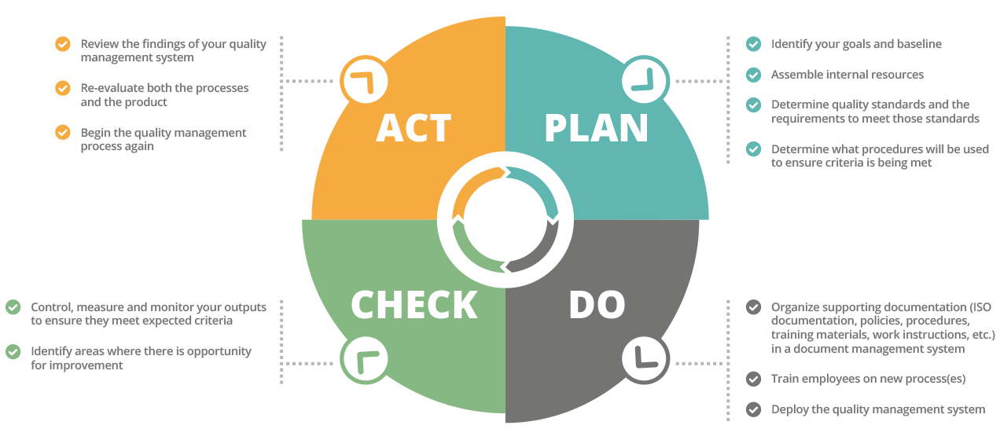

# Quality management

Quality management is a process to ensure that products or services meets customer expectations. It involves continuous improvement of processes, systems, and policies to enhance the quality of output. Quality management also includes setting and measuring performance standards and implementing corrective actions when necessary.

<figure>
    
    <figcaption>
        Quality management system  
        <i>Source: https://info.docxellent.com/blog/main-components-quality-management</i>
    </figcaption>
</figure>

## The four main components of quality management

1. Quality planning:
This is the first step of quality management. Identify your goals on the project, determine what your quality standards, the requirements to meet the standards and what actions should be made to get these criteria meet.

At this stage, you could consider the following:
    - What is your stakeholder's expectations and priorities?
    - What legal standards or requirements must be followed?
    - Who will handle each role in the quality management process?
    - How often processes will be evaluated?

2. Quality control:
This step is to physically inspect and test to ensure that what you outlined during the planning stage.
    - Confirm that all the standard you have put into place are met.
    - Identify any mishaps or errors that need to be corrected.
    - Pay close attention to every element of the product, including the parts used and the assembly process.

The sooner you catch the flaws, the better. Once the inspection information has been collected, it makes it easier to analyze. You can now, for example, create histograms or run charts and share them with your team members via the project management software so they can review them.

3. Quality assurance:
The quality assurance is to review the delivery process of service. By inspecting it, you can catch the faults before delivering it to the customer.
    - Verify that everything is functioning as it was intended during the quality planning stage.
    - Analyze the efficiency of your predetermined processes and verify that all requirements for compliance are being met.
    - Determine the areas where a smoother process on the project might be possible.

Independent audits must be conducted frequently as part of quality assurance. The audit should be carried out by a third party who has no financial or emotional stake in the outcome if you want the best outcomes.

4. Quality improvement:
After the quality control process is finished, review your findings carefully from the last 3 components and come up with a way to improve your methods going forward. If you are unwilling to make adjustments when they are required, quality control management will be ineffective. Every successful business strives for constant improvement.

### References and additional reading
[Quality management: Definition and example](https://www.investopedia.com/terms/q/quality-management.asp)
[Four main components of a quality management systmen](https://info.docxellent.com/blog/main-components-quality-management)