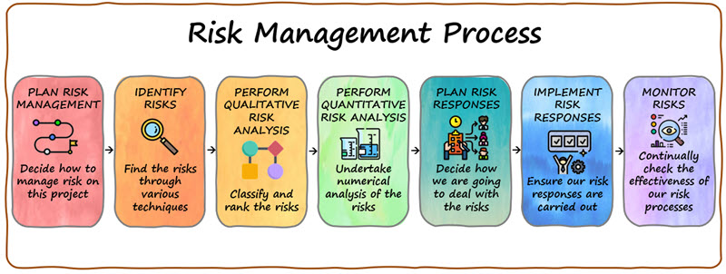

# Risk management

Project management includes risk management, of which purpose is to systematically 
acknowledge risks, prepare for the possible occurance of a risk, and make a contingency 
plans if risks occur. Risks are assessed to prevent negative impacts on the projects.
Without risk management project's quality, cost and schedule are at stake. 

## How to manage risks

When assessing risks it's good practice to start by assessing the project itself as 
a whole. When the project is divided in to different parts it's easier to see the 
possible risks. These parts can be for example the project's vision, scope, objects 
and deliverables.

There are different takes on risk management process but most of them follow rouhgly 
this process below:

1. Identify risks: Identify potential risks that could impact the project, such 
as risks related to project scope, resources, stakeholders, technology, or external 
factors. Brainstorm with project team members, subject matter experts, or other 
stakeholders to identify all possible risks. This will increase the knowledge of 
possible risks in a particular project, and the risks can be written in a table where 
they can be further analyzed. 

2. Analyze risks: Assess the likelihood and impact of each identified risk on the 
project's objectives. At least bigger companies already have a risk assesment 
methods that are there to assist with risk analysis. Qualitative and/or quantitative 
techniques can also be used to evaluate the risks, such as risk probability and impact 
assessment, risk mapping, or risk scorecards.

3. Prioritize risks: When categorizing the risks in low, medium and high, based on the 
risk's overall effect on the project, it's also easier to evaluate how much resources 
have to be put in if the risk occurs. After prioritizing it's easy to write the risk 
management plan. 

4. Assign owner to a risk: The risk has to have an owner who is responsible for the 
actions if the risk occurs. It's good if the person responsible has the best knowledge 
about the possible risk but the most important thing is to have an owner for each risk.

5. Respond to the risk: Develop strategies to respond to each risk, such as avoiding 
the risk, mitigating the risk, transferring the risk, or accepting the risk. Determine 
the appropriate risk response based on the level of risk and the available resources. 
The best solution is to minimize the impact of the risk on the project. Responding to 
a risk includes involving the assigned owner for it.

6. Monitor risks: Continuously monitor and control the identified risks throughout the project life cycle. Update the risk management plan as needed and take corrective action when necessary. Communication is the key in risk monitoring so regular meetings with all the stakeholders are necessary.
Risk owner is mainly responsible for monitoring the risk, but project manager has to be on top of everything all the time. 

 
 
Here is another example of a risk management process:

<figure>
    
    <figcaption>
        Risk management process  
        <i>Source: https://www.pmillustrated.com/2-3-manage-risks/</i>
    </figcaption>
</figure>

Remember, effective risk management requires a proactive approach and ongoing communication and collaboration with stakeholders. By following these basic steps, you can help ensure that your project stays on track and achieves its objectives despite potential risks.
 

### References and additional reading
 [Risk management](https://www.pmi.org/learning/library/risk-management-9096)
 
 [Risk management process](https://www.projectmanager.com/blog/risk-management-process-steps)