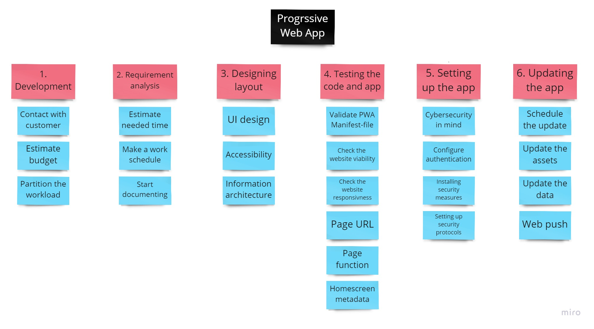
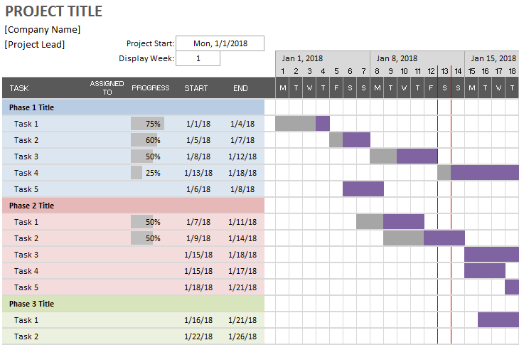
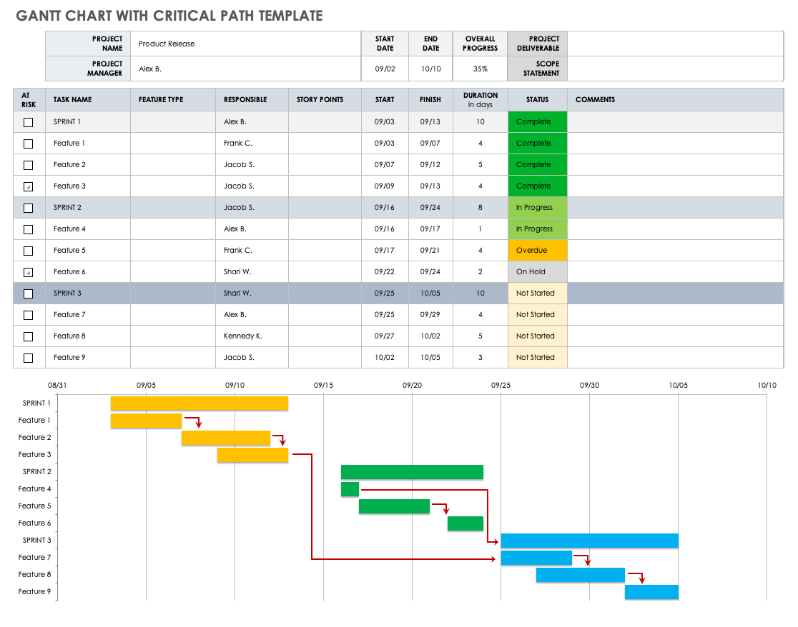

# Work Breakdown Structure (WBS)

WBS is a visual tool used to break a project into smaller pieces. It starts with
the project goal and breaks it into smaller tasks until every task required to
complete the project is listed. This helps to identify needed resources and
the total work required to complete the project.

<figure>
    
    <figcaption>WBS diagram</figcaption>
</figure>

## Steps for creating a WBS

1. Start by breaking down the project into its major tasks and activities. These
   should be the highest-level tasks that you need to complete for the project to
   be successful.
2. Decompose each major task into its component tasks and activities. This
   decomposition should keep going until tasks can no longer be broken down into
   smaller tasks.
3. Estimate the duration of each task. This should be done in consultation with
   the team members working on the project.
4. Determine the dependencies between tasks. This will help you identify which
   tasks need to be completed before others can be started.
5. Assign resources to each task. This should include the people, equipment, and
   other resources needed to complete the task.
6. Identify the critical path. This is the sequence of tasks that have the
   longest duration and the least amount of slack.
7. Estimate the total duration of the project. This should be done by summing up
   the duration of all tasks on the critical path.

## What you need to consider when making a WBS

1. Scope: You need to make sure that the scope of the project is clearly
   defined. This will help make sure that all tasks and activities are included in
   the WBS.
2. Duration: You need to estimate the duration of each task. This will help you
   determine the total duration of the project.
3. Dependencies: You need to identify the dependencies between tasks. This will
   help you identify which tasks need to be completed before others can be started.
4. Resources: You need to assign resources to each task. This should include the
   people, equipment, and other resources needed to complete the task.
5. Critical Path: You need to identify the critical path. This is the sequence
   of tasks that have the longest duration and the least amount of slack.

A realistic schedule for each task can be determined by considering the duration
of each task and the dependencies between tasks. This will help you determine
which tasks can be completed concurrently and which tasks form the critical
path.

# GANTT chart

A GANTT chart is a visual representation of the project's tasks compared to time.
A simple GANTT chart could be just a vertical bar chart, but it is also possible
to add extra information for example milestones and the critical path of the
project. To create a GANTT, the project must first be broken down into tasks and
those tasks should have at least a rough time estimate.

<figure>
    
    <figcaption>Simple GANTT chart</figcaption>
</figure>
 
 
<figure>
    
    <figcaption>
        GANTT chart with critical path  
        <i>Source: https://www.smartsheet.com/content/gantt-chart-critical-path</i>
    </figcaption>
</figure>

### References and additional reading

[The work breakdown structure (WBS) for project management: What it is and how
to use it](https://asana.com/resources/work-breakdown-structure)

[Gantt Charts and Critical Path Analysis](https://www.smartsheet.com/content/gantt-chart-critical-path)
