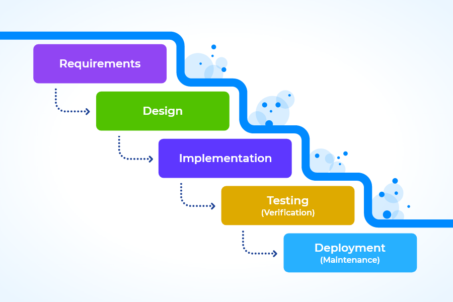

# Waterfall management

Waterfall management is a traditional project management method. In this specific approach, every project phase is clearly defined, and you can't advance to the next step without the previous step being fulfilled. The name comes from the phases where the process flows from one stage to the following stage like how a waterfall cascades down from higher to lower point.

When completing a step, it is difficult and costly to revisit the previous step. Agile teams follow different ways of operandi and thus they can easily revisit previous steps.

In waterfall, the key characteristics are that the scope of the project is clearly defined, and the project team follows from each phase to the next one. This approach provides a clear and structured process to complete the project. You can see the progress of the project through every step. Detailed planning and tracking are essential parts of the progress. The waterfall method typically includes phases such as: analysis, designing, implementation, testing and maintenance.

### Waterfall management process

<figure>
    
</figure>

**Source:** [**https://blog.vault-erp.com/post/2022/12/07/the-waterfall-approach-to-project-management-with-vault-erp**](https://blog.vault-erp.com/post/2022/12/07/the-waterfall-approach-to-project-management-with-vault-erp)

## History

After nine years of working for space mission programs, Dr. Royce published his prejudiced presentation. In the presentation, he described his views on how to manage large software programs. The paper was published in 1970 and titled "Managing the Development of Large Software Systems."

The paper contained insights and got famous. It propelled waterfall to the forefront of software project management.

Waterfall management was uncontested until the 1990s when serious drawbacks had been identified and candidates like Scrum (1995) and such were being tested.

## Suitability

This management style is not suitable for projects with changing requirements nor dynamic environments. Also, if the scope is not clearly defined it is hard to use this approach. That's why when everything in this project is clear can this approach work it is also the reason why bigger companies use this method. This method is made for bigger project teams since it would just be a complete disaster if that many people together would try to work using the agile management style.

The waterfall management style is mostly designed and used for larger companies thus following a set schedule and step-by-step work is very important. The approach follows linear and sequential formulas where work is predictable and thus teams are unable to adjust faster compared to the competitors.

Missing even a single deadline or changing the scope during waterfall causes enormous impacts because there are so many parts to projects where we must take care of the quality as well. When we only dedicate our work towards the next phase then the testing part and fixing part gets out shadowed and down the line can cause the entire project to fail.

### References and additional reading:

[Introduction to waterfall project management method](https://softwaredominos.com/home/software-design-development-articles/waterfall-project-management-a-brief-history-and-introduction/)

[Agile vs. waterfall project management](https://www.atlassian.com/agile/project-management/project-management-intro)

[What is waterfall project management?](https://www.wrike.com/project-management-guide/faq/what-is-waterfall-project-management/)